# 🐾 Pet Lovers Community Platform - Project SWD392 - FPT University HCM - SPRING2025

  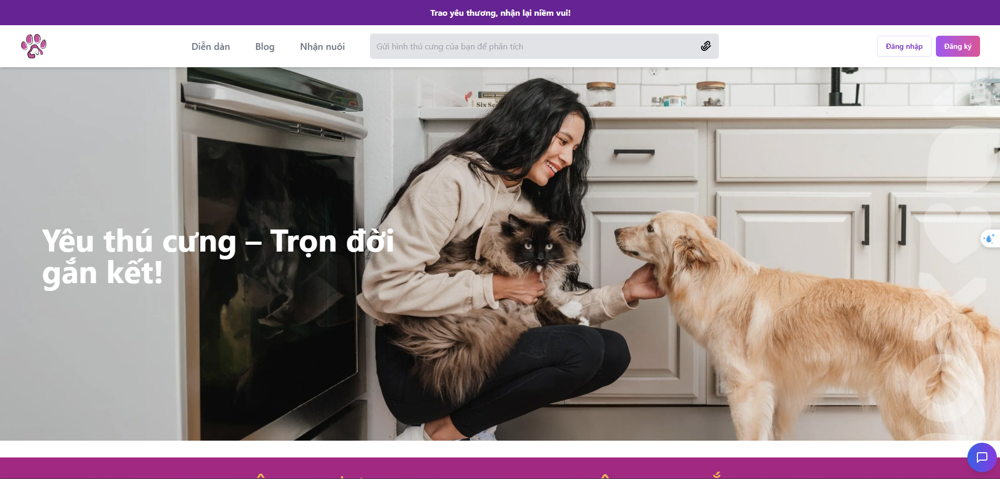

## 💡 What You’ll Find in This Repository:

- A full-stack web platform to help users adopt pets and share pet care knowledge
- AI features: breed classification from images, smart chatbot
- Real-time messaging and donation support
- Role-based system: Admin | Staff | Member
- Blog/forum management with content moderation
- Secured with JWT and bcrypt

---

## 🧭 Table of Contents

- [📖 About](#about)
- [🚀 Preview Screenshot](#preview-screenshot)
- [🛠 Technology Stack](#technology-stack)
- [📋 Functional Requirements](#functional-requirements)
- [🧑‍💻 Contributors](#contributors)
- [📜 License](#license)

---

## 📖 About

PLC (Pet Lovers Community) is an AI-integrated platform designed for the pet-loving community to send, adopt, and discuss pets. Built with modern technologies and inspired by compassion, the system ensures transparency and security across all adoption and community interactions.

> ✨ _“Helping abandoned animals find new homes — powered by code and love.”_

---

## 🚀 Preview Screenshot

### 🐶 User

&nbsp;
&nbsp;
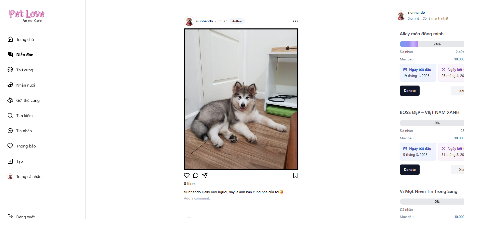&nbsp;
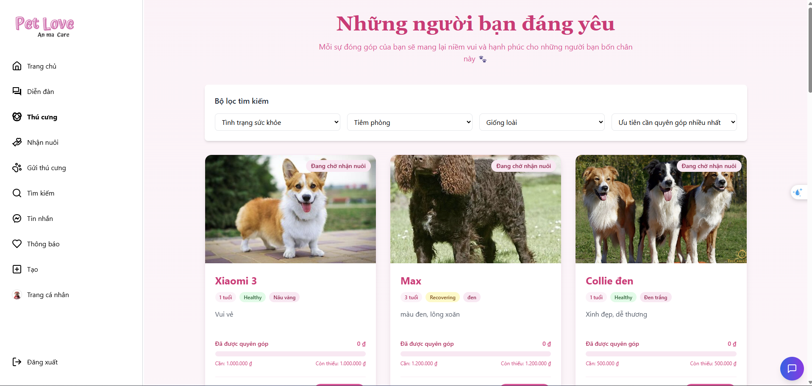&nbsp;
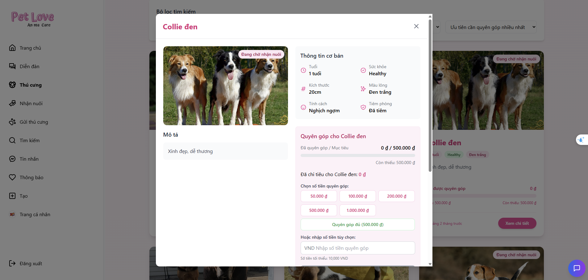&nbsp;
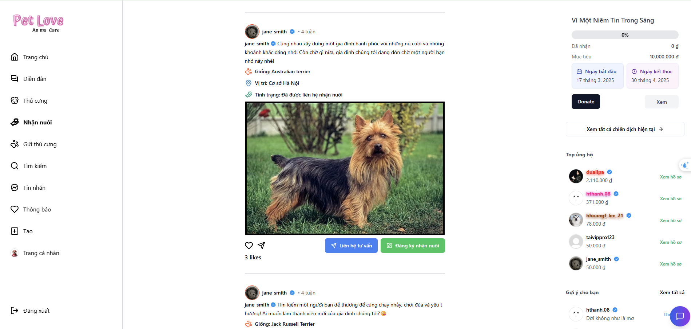&nbsp;
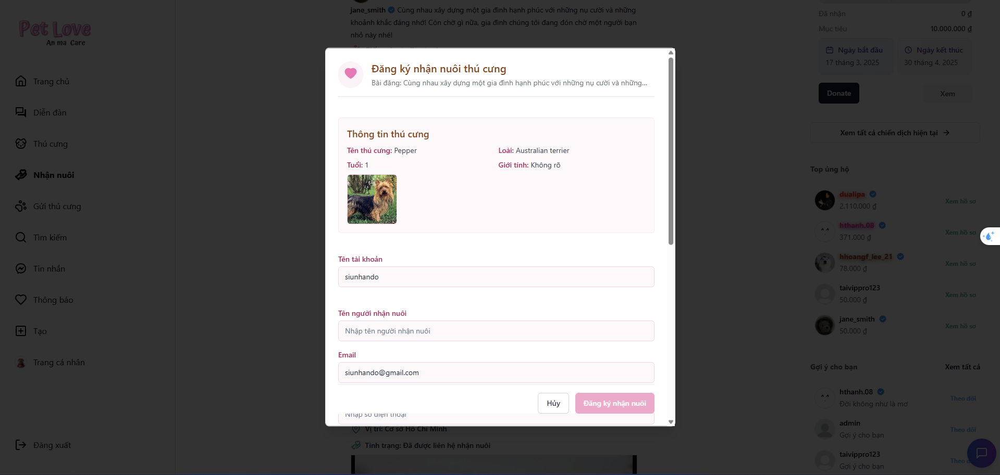&nbsp;
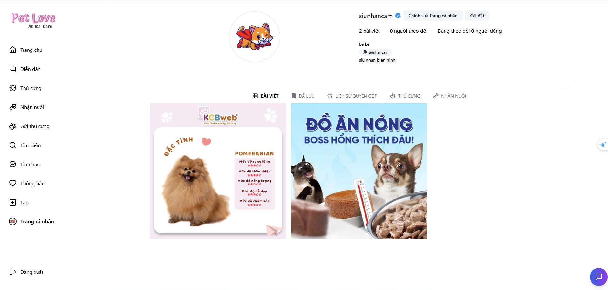&nbsp;

### 💬 Staff

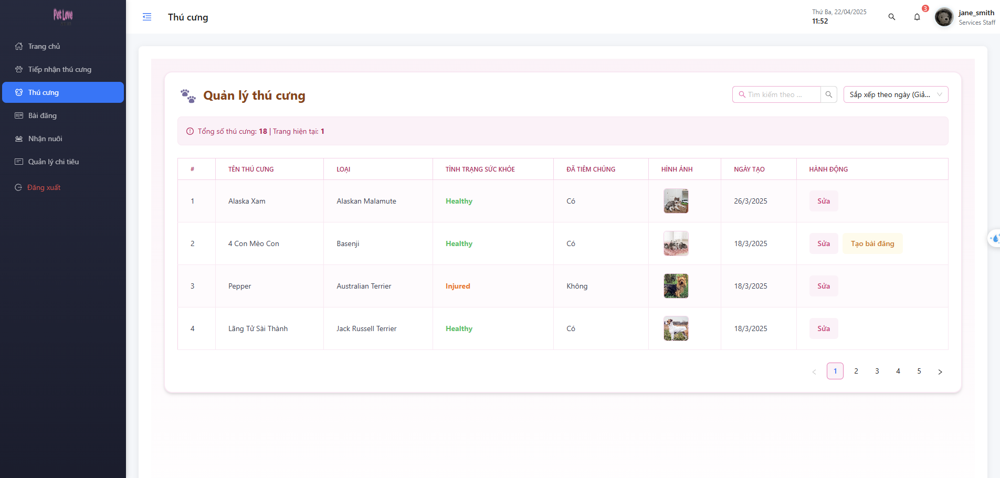&nbsp;
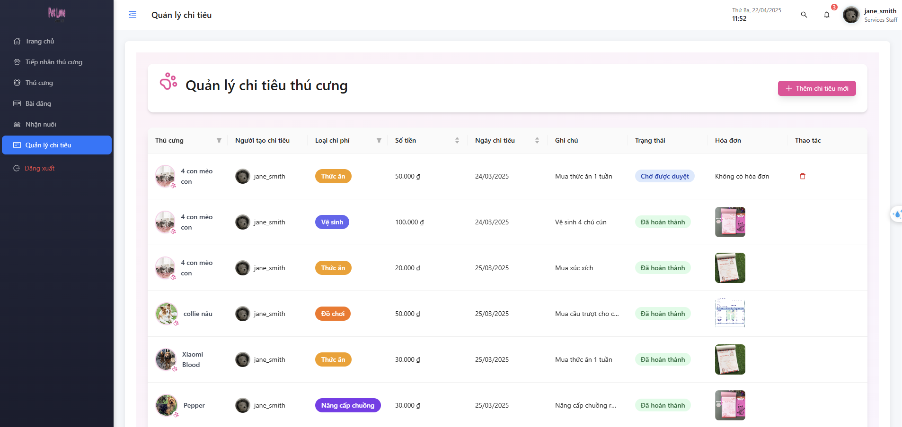&nbsp;
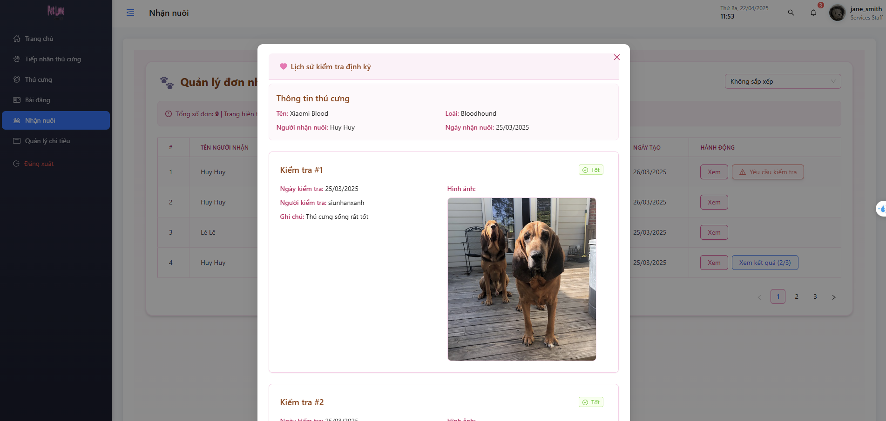&nbsp;

### 💸 Admin

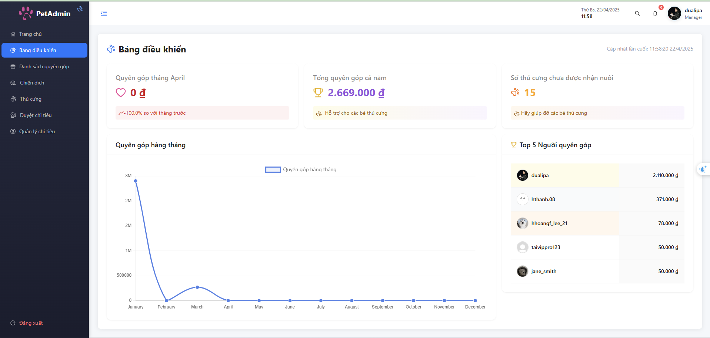&nbsp;
&nbsp;
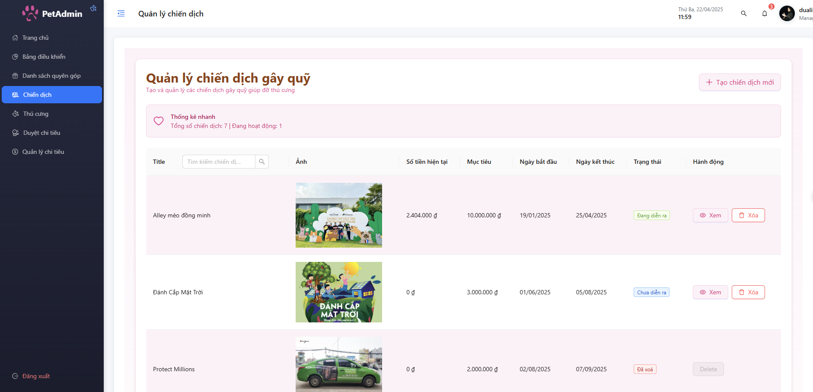&nbsp;
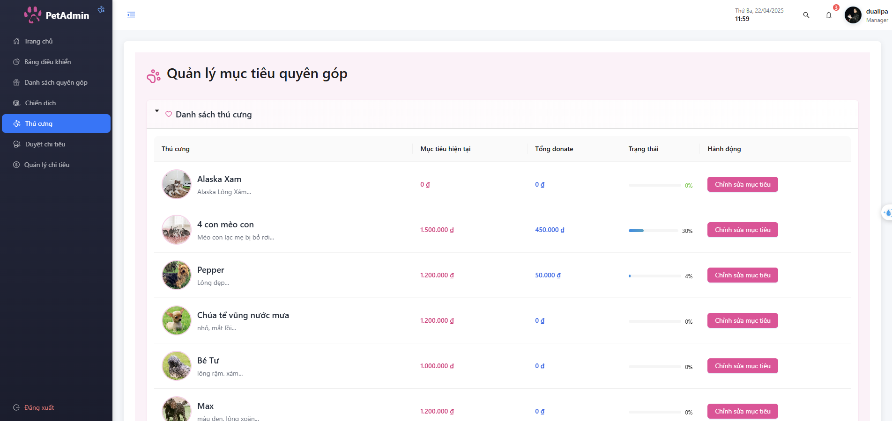&nbsp;
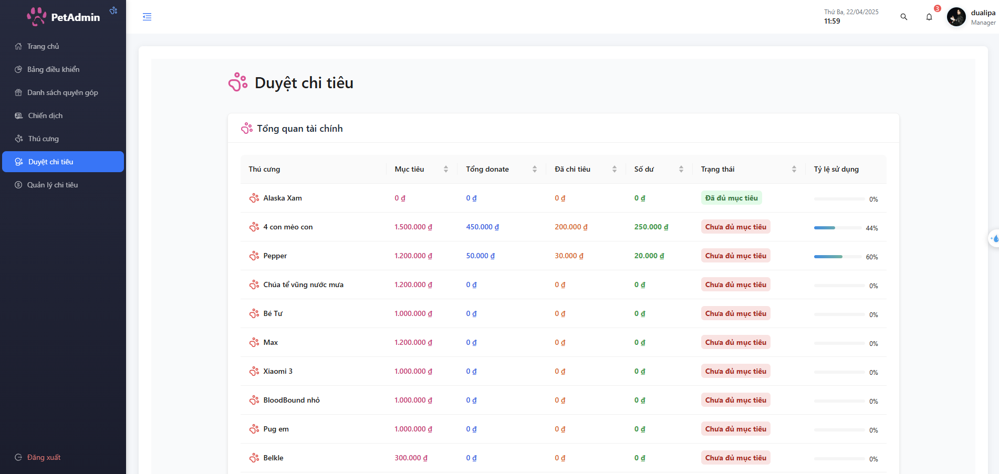&nbsp;

---

## 🛠 Technology Stack

### 🔧 Frontend

- React.js + Redux

### ⚙️ Backend

- Node.js + Express.js
- MongoDB (NoSQL)
- Cloudinary (image storage)
- Prom DeepSeek for AI chatbot logic

### 🔐 Security

- JWT
- Bcrypt for password hashing
- Role-based authentication

### 🌐 Realtime

- Socket.io for messaging, notifications

  
  
  
  
  
  
  

---

## 📋 Functional Requirements

### 👤 Member

- [x] Register & login
- [x] Upload pet images for classification
- [x] Chat with AI chatbot
- [x] View and adopt pets
- [x] Real-time messaging
- [x] Create & interact with posts
- [x] Donate to campaigns
- [x] Donate to pets

### 🧑 Staff

- [x] Approve pet submissions
- [x] Manage pet info and adoption process
- [x] Create and track adoption forms
- [x] Moderate community posts
- [x] Update on pet care and spending

### 👑 Admin

- [x] Manage staff & members
- [x] Create/manage donation campaigns
- [x] Monitor donation stats and revenue
- [x] Manage pet spending budget
- [x] Platform analytics dashboard

---

## 🧑‍💻 Contributors 😎

| 👤 Name             | 🧾 Student Code | 🧠 Role     |
| ------------------- | --------------- | ----------- |
| Lê Văn Huy Hoàng    | SE170333        | Team Leader |
| Hoàng Việt Đức      | SE170590        | Developer   |
| Phùng Hữu Thành     | SE170345        | Developer   |
| Nguyễn Công Duy Bảo | SE171741        | Developer   |
| Lê Thành Tài        | SE171090        | Developer   |

---

## 📜 License

Licensed under the MIT License © 2025

> 🐾 Feel free to fork, star, or contribute to this project — your support means a lot to the pets and the people who care about them!
